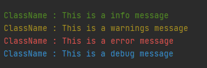

# SimpleLogger
Simple Java error handler/logger

## Installation

Just put it in your project and change the package to something that fits you.

## Usage

```java
import com.mygame.utils.SimpleLogger;
SimpleLogger.info("ClassName", "This is a info message");
SimpleLogger.warning("ClassName", "This is a warnings message");
SimpleLogger.error("ClassName", "This is a error message");
SimpleLogger.debug("ClassName", "This is a debug message")
```



